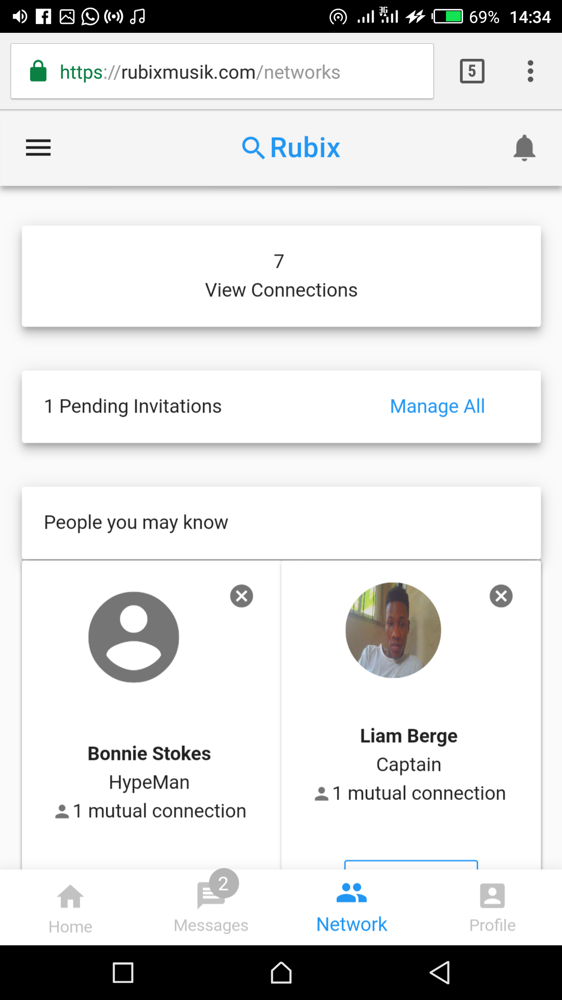

# Rubix App
> https://apprubix.herokuapp.com

                                 


## Installation

Follow this steps to build locally:

```sh
Clone project
composer install
php artisan migrate:fresh --seed
php artisan serve
```
## Details

Rubix Music is a social media platform PWA built with Laravel and VueJs. Basic functionalities allows you to search users, check a user profile, edit your profile, send connect requests, accept or decline connect requests, block connects, message connects, view suggestions of people you may know based on mutual connects and location all in real time. Your feeds lets you view posts, likes, comments and shares by connect in real time you can create a post, like a post, comment or share a post and its all broadcasted in real time

      

